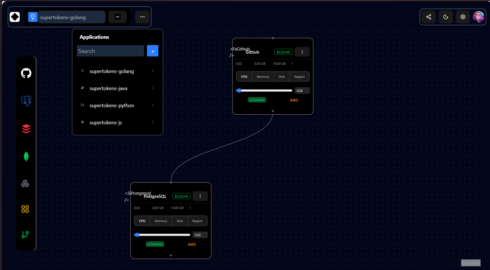

# App Graph Builder



## Project Structure

```
/
├── public/              # Static assets
├── src/
│   ├── app/    # App-wide routing/configurations
        |- App.tsx
        |- main.tsx
        |- providers.tsx        
│   ├── assets/          # Source assets (images, icons)
│   ├── canvas/      # Canvas specific logic
        |- edges.ts
        |- Flow.tsx
        |- nodes.tsx
│   ├── components/      # Shared components
        |-nodes/
            |- ServiceNode.tsx
        |- ui
│   ├── layout/          # Layout components
        |- LeftRail.tsx
        |- TopBar.tsx
        |- RightPanel.tsx
        |- MobileDrawer.tsx
│   ├── lib/             # Utility libraries
│   ├── mocks/           # Mock data/testing
        |-browser.ts
        |- handlers.ts
│   ├── queries/         # Data fetching queries
        |- apps.query.ts
        |- graphs.query.ts
│   ├── store/           # State management
        |- useAppStore.ts
        |- useGraphStore.ts
│   ├── types/           # TypeScript types


```
## Tech Stack used:

- **React + Vite**
- **TypeScript (strict: true)**
- **ReactFlow (xyflow)**
- **shadcn/ui**
- **TanStack Query**
- **Zustand**
- **MSW**(mock api)

### Tanstack Query:

### **TanStack Query (mock APIs)**

Implemented these mock endpoints (in-memory, simulated latency):

- GET /apps → returns a list of apps
- GET /apps/:appId/graph → returns nodes + edges for the selected app

**Mocking approach :**
- MSW (Mock Service Worker)


### Zustand (for state management):

### **Zustand (required state)**

Used Zustand for non-server UI/app state:

- selectedAppId
- selectedNodeId
- isMobilePanelOpen
- activeInspectorTab

### Key decision:

- Create the node stucture first
- to select node, update the state of the selected nodes (use zustand)
- create the dummy data for graphs and apps to be fetched by calling api.
- when node delete, update both nodes and edges.


